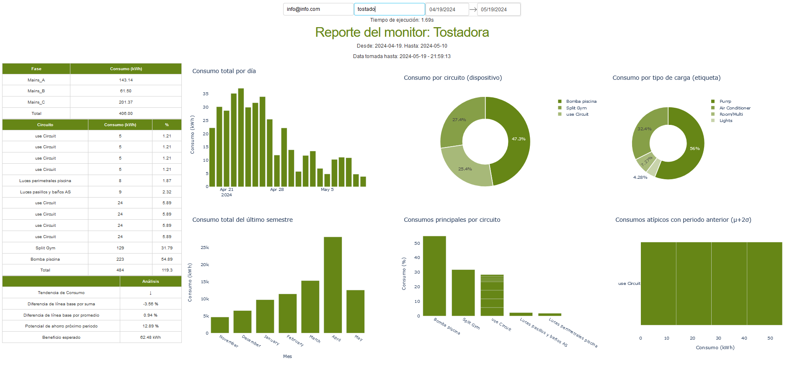

# Acceso a datos, identificación de variable objetivos y definición de hipótesis de partida.

## Acceso a Datos:
Primero, nos aseguramos de tener acceso a la API de Emporia. Esto implica:
    - Registrarte como desarrollador en Emporia para obtener las credenciales necesarias, como el API Key.
    - Revisar la documentación de la API de Emporia para entender los endpoints disponibles, los métodos de solicitud (GET, POST, etc.), y los formatos de respuesta. En este caso, json con los consumos actuales.
    - El acceso al Dash requiere de un correo, en este caso: info@info.com, como también, el monitor que se quiere analizar, el cual está sujeto al fichero 'db'.
    
## Identificación de Variables Objetivo:
Las variables objetivo son justamente las que visualizo en el panel de la app web, tales como,
    - Consumo actual de energía.
    - Consumo histórico de energía por día/semana/mes.
    - Costos asociados al consumo de energía.
    - Datos de generación de energía (si se dispone de paneles solares, por ejemplo).
    - Estado y salud de las baterías del hogar (si aplicable).

## Definición de Hipótesis de Partida:
Hipótesis Principal: "Proporcionar a los usuarios una visualización en tiempo real y un histórico del consumo de energía les permitirá gestionar de manera más eficiente su uso de energía, reduciendo costos y optimizando el consumo."

# Diseño del flujo de trabajo de las diferentes fases/etapas.

# Implementación de funciones/componentes para la preparación de datos.
La conexión a la API se encuentra por medio de grpc y la visualización en transforming.py, también, el despliegue de la app en app.py.

# Implementación de funciones/componentes para monitorizar el funcionamiento del modelo a partir de las métricas seleccionadas.
Dado que tenemos acceso 24/7 en nube por medio de Onrender, podemos verificar el estado de la aplicación, junto con todos sus componentes.