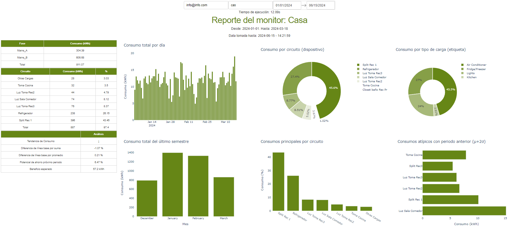
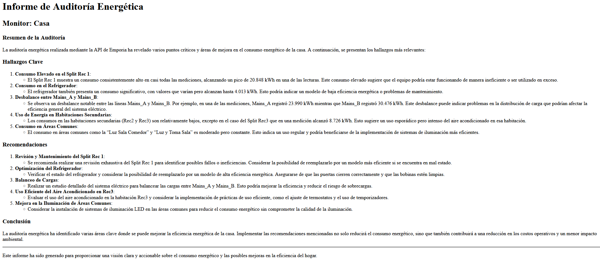

# Emporia energy & OpenAI

# Acceso a datos, identificación de variable objetivos y definición de hipótesis de partida.

## Acceso a Datos:
El acceso a la API de Emporia, implica,
    - Registrarse como desarrollador de Emporia Partner Portal para obtener las credenciales necesarias, como el API Key.
    - Revisar la documentación de la API de Emporia para entender los endpoints disponibles, los métodos de solicitud (GET, POST, etc.), y los formatos de respuesta. En este caso, json con los consumos actuales.
    - El acceso al Dash requiere de un correo, en este caso: info@info.com. Como también el monitor que se quiere analizar, el cual está sujeto al fichero /db.

El acceso a la API de Openai, implica,
    - Registrarse en OpenAI y obtener API-key.
    - Documentación de Request, Response, Formatos y prompt: docs\Prompting para Large Language Models.pdf
    - Formato de salida: docs\Casa_informe.html

Variables de entorno: [OPEN_AI__API_KEY:str, emporia_email:str, emporia_password:str].
    
## Identificación de Variables Objetivo:
Las podemos visualizar en el panel de la app web, tales como,
    - Consumo actual de energía.
    - Consumo histórico de energía por día/semana/mes.
    - Costos asociados al consumo de energía.
    - Datos de generación de energía (si se dispone de paneles solares, por ejemplo).
    - Estado y salud de las baterías del hogar (si aplicable).
    - Informe detallado, generado por IA de nuestros consumos de energía eléctrica, advertencias, peligros, entre otros.

## Definición de Hipótesis de Partida:
Hipótesis Principal: "Proporcionar una visualización atractiva e informe generado por IA, aportando un histórico del consumo de energía para gestionar de manera eficiente su uso final de la energía, reduciendo costos, optimizando consumos y evitando peligros."

# Diseño del flujo de trabajo de las diferentes fases/etapas.

# Implementación de funciones/componentes para la preparación de datos.
Todas las conexiones las vemos en /src, allí detalles las /apis_x, y la visualización de datos /transforming.py, finalmente, un aplicativo localhost tipo Dash en: /app.py

# Implementación de funciones/componentes para monitorizar el funcionamiento del modelo a partir de las métricas seleccionadas.
Dado que tenemos acceso 24/7 en nube por medio de Onrender, Heroku, VM's, etc., podemos verificar el estado de la aplicación, junto con todos sus componentes. O de manera localhost.